

   

<h1 align="center">
Codigrate Themes for Sublime Text
</h1>

A carefully crafted collection of Sublime Text color schemes inspired by nature and iconic cities around the world.
Each theme is designed with balance, readability, and long coding sessions in mind—blending distinctive atmospheres
with thoughtfully tuned colors that make your editor feel both elegant and comfortable.
Whether you prefer calm, light environments or deep, immersive dark palettes,
these themes aim to make your coding experience visually inspiring and pleasantly focused.

## Getting Started

1. Install **Sublime Text** on your system.
2. Copy the theme's `.sublime-color-scheme` AND `.sublime-theme` files into your `Packages/User` directory
   (`Preferences → Browse Packages…` opens it).
3. Open `Preferences → Select Color Scheme…` and pick the theme by name — this paints the editor.
4. Open `Preferences → Select Theme…` and pick the same name — this paints the window
   (sidebar, tabs, status bar) with the theme's own palette.

## Notes

- These themes are designed for **Sublime Text 4** (the UI theme extends the built-in Adaptive theme).
- Theme appearance may vary slightly depending on your operating system, font rendering, and syntax definitions.
- The syntax palette matches the Codigrate VS Code and JetBrains ports of the same theme.

## Nature

   

<h1 align="center">
Aurora Borealis
</h1>

## Description

Inspired by the natural phenomena of the Aurora Borealis, this dark theme captures the majesty and mystery of the Arctic night sky. Dark blues and teals serve as the backdrop, while lighter accents echo the ethereal colors of the Northern Lights. The palette is designed to be easy on the eyes, helping you focus, and code efficiently.

## Screenshots

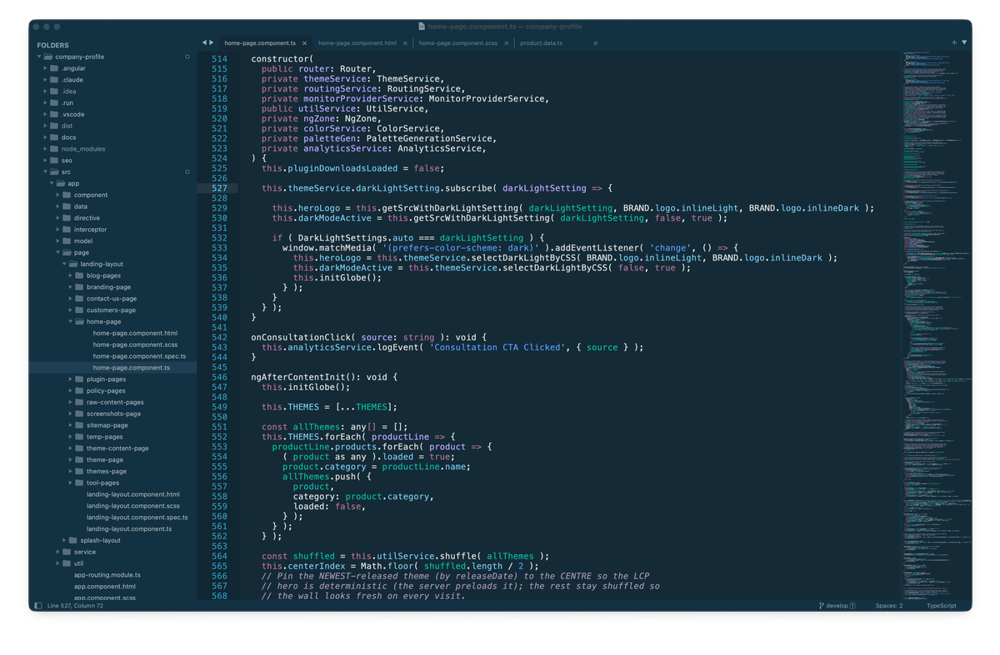

## Color Palette

<table>
   <tr>
      <td></td>
      <td>Background</td>
      <td>#142B37</td>
   </tr>
   <tr>
      <td></td>
      <td>Foreground</td>
      <td>#E0E0E0</td>
   </tr>
   <tr>
      <td></td>
      <td>Accent</td>
      <td>#7AC6F5</td>
   </tr>
</table>

   

<h1 align="center">
Autumn
</h1>

## Description

Inspired by the warm hues and rustic feel of the autumn, this light theme aims to evoke a sense of comfort and tranquility. It blends soothing earth tones and crisp air-like whites, capturing the essence of fall leaves and late afternoon sunlight. The palette is designed to be gentle on the eyes, promoting focus and productivity.

## Screenshots

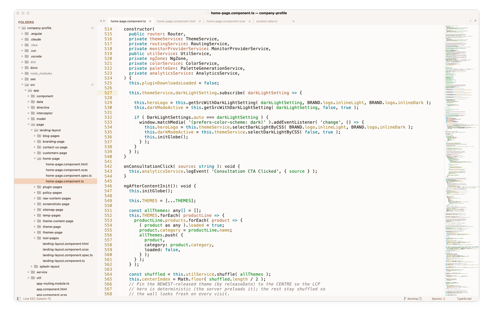

## Color Palette

<table>
   <tr>
      <td></td>
      <td>Background</td>
      <td>#FCFBFA</td>
   </tr>
   <tr>
      <td></td>
      <td>Foreground</td>
      <td>#251B13</td>
   </tr>
   <tr>
      <td></td>
      <td>Accent</td>
      <td>#A7714C</td>
   </tr>
</table>

   

<h1 align="center">
Everest
</h1>

## Description

Inspired by the majestic heights and serene landscapes of Mount Everest, this light theme aims to provide a calming and focused coding environment. The soft blues and grays mimic the icy terrains, while subtle hints of warmer colors evoke the golden hues of dawn breaking over snow-capped peaks.

## Screenshots

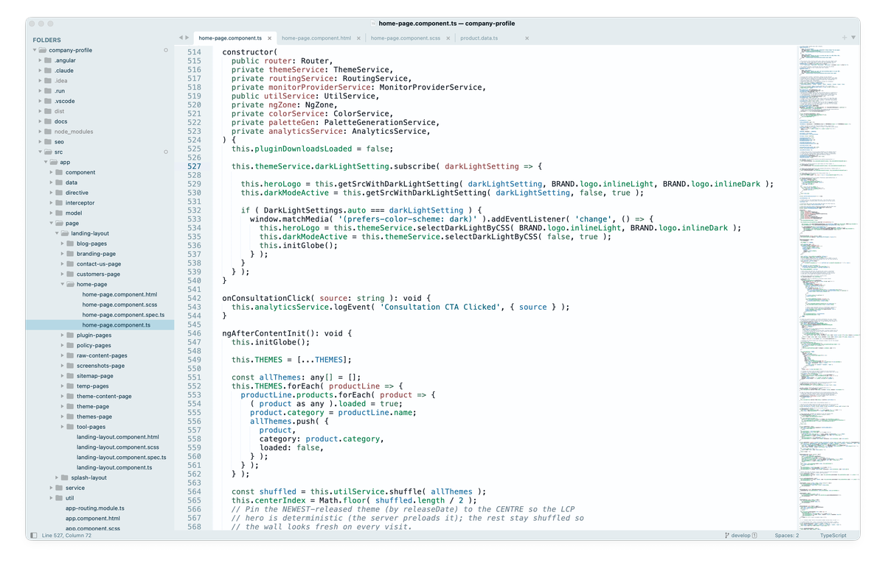

## Color Palette

<table>
   <tr>
      <td></td>
      <td>Background</td>
      <td>#FDFEFF</td>
   </tr>
   <tr>
      <td></td>
      <td>Foreground</td>
      <td>#131B25</td>
   </tr>
   <tr>
      <td></td>
      <td>Accent</td>
      <td>#246A89</td>
   </tr>
</table>

   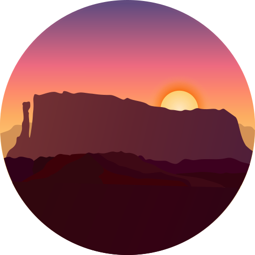

<h1 align="center">
Roraima
</h1>

## Description

Inspired by the captivating sunset over Mount Roraima, this dark theme seamlessly blends the deep twilight hues of blues and purples with the fiery brilliance of oranges and yellows. Evoking the serene majesty of Roraima as day transitions to night, this balanced palette offers a soothing yet invigorating backdrop, ensuring an optimal and focused coding experience.

## Screenshots

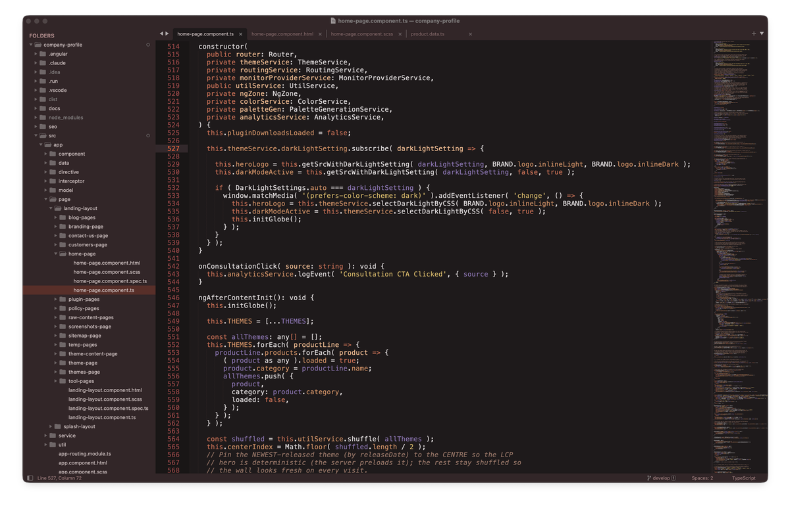

## Color Palette

<table>
   <tr>
      <td></td>
      <td>Background</td>
      <td>#1E1A1B</td>
   </tr>
   <tr>
      <td></td>
      <td>Foreground</td>
      <td>#E4E0E1</td>
   </tr>
   <tr>
      <td></td>
      <td>Accent</td>
      <td>#CC654E</td>
   </tr>
</table>

   

<h1 align="center">
Sakura
</h1>

## Description

Inspired by the enchanting allure of Sakura blossoms, this theme encapsulates the soft, calming essence of spring. Delicate pinks serve as the backdrop, representing the blossoms, while muted greens and blues act as complementary accents, reflecting the tranquil garden and clear sky. The palette, akin to a serene, blooming Sakura garden, is designed to be easy on the eyes, aiding focus and efficient coding.

## Screenshots

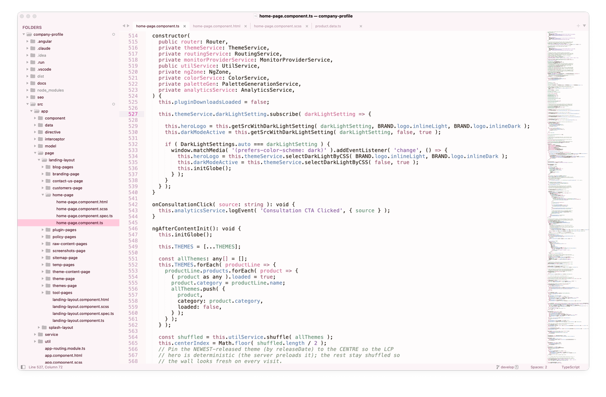

## Color Palette

<table>
   <tr>
      <td></td>
      <td>Background</td>
      <td>#FEFCFC</td>
   </tr>
   <tr>
      <td></td>
      <td>Foreground</td>
      <td>#251B13</td>
   </tr>
   <tr>
      <td></td>
      <td>Accent</td>
      <td>#B54B66</td>
   </tr>
</table>

   

<h1 align="center">
Sequoia
</h1>

## Description

Inspired by the towering presence and serene environment of sequoias, it envelops your IDE in deep blacks and browns, providing a calm and focused coding atmosphere. Accents of vibrant green illuminate the interface subtly, mirroring the vitality of these magnificent trees. Venture into the digital woods, and let its grounded, tranquil palette guide you through the logical forest of your code efficiently.

## Screenshots

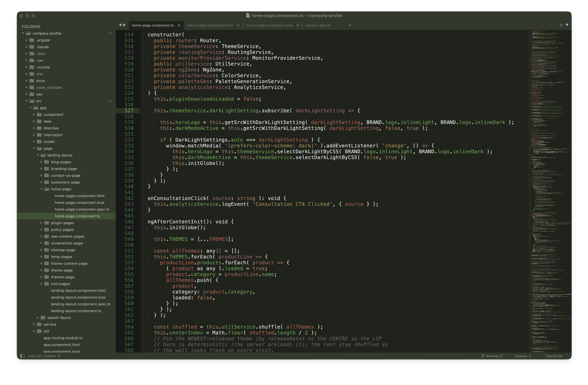

## Color Palette

<table>
   <tr>
      <td></td>
      <td>Background</td>
      <td>#20231C</td>
   </tr>
   <tr>
      <td></td>
      <td>Foreground</td>
      <td>#DEDDDC</td>
   </tr>
   <tr>
      <td></td>
      <td>Accent</td>
      <td>#73A621</td>
   </tr>
</table>

## Cities

   

<h1 align="center">
Istanbul
</h1>

## Description

Inspired by the soft daylight and sea breezes of Istanbul, this theme blends calm turquoise tones with warm historical accents to create a serene yet expressive coding environment. Light, airy backgrounds keep the editor clean and comfortable, while teals, aquas, and muted golden hues add clarity and focus to essential syntax elements.

## Screenshots

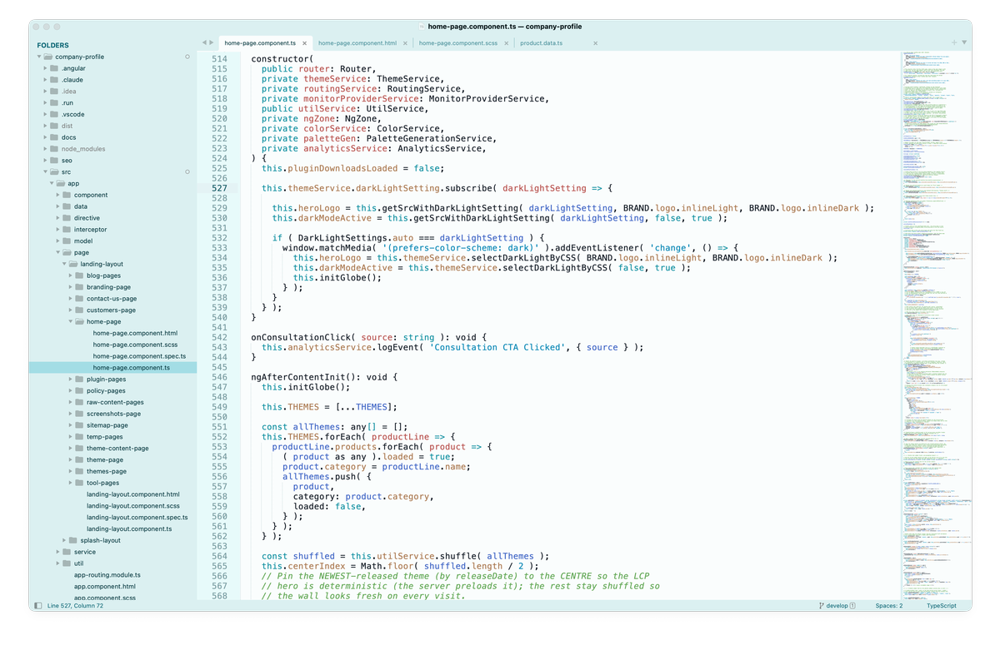

## Color Palette

<table>
   <tr>
      <td></td>
      <td>Background</td>
      <td>#FAFDFD</td>
   </tr>
   <tr>
      <td></td>
      <td>Foreground</td>
      <td>#131B25</td>
   </tr>
   <tr>
      <td></td>
      <td>Accent</td>
      <td>#087E8E</td>
   </tr>
</table>

   

<h1 align="center">
Miami
</h1>

## Description

Inspired by the electric nights and pastel sunsets of Miami, this theme blends deep purples with vibrant neon accents to create a bold yet balanced coding environment. Dark, warm backgrounds ground the editor, while vivid pinks, corals, and tropical teals bring energy and clarity to key syntax elements.

## Screenshots

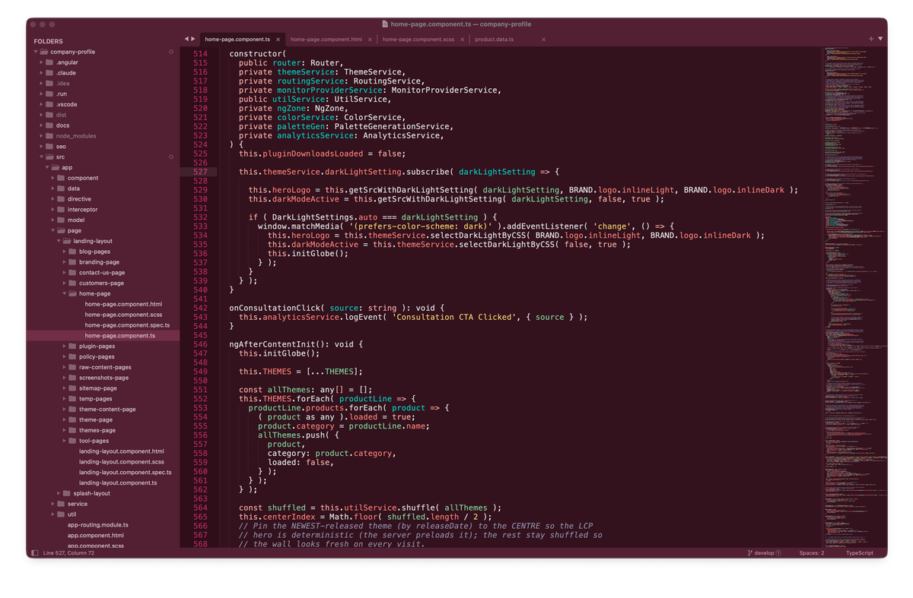

## Color Palette

<table>
   <tr>
      <td></td>
      <td>Background</td>
      <td>#33121D</td>
   </tr>
   <tr>
      <td></td>
      <td>Foreground</td>
      <td>#E0E0E0</td>
   </tr>
   <tr>
      <td></td>
      <td>Accent</td>
      <td>#FF5FA2</td>
   </tr>
</table>

   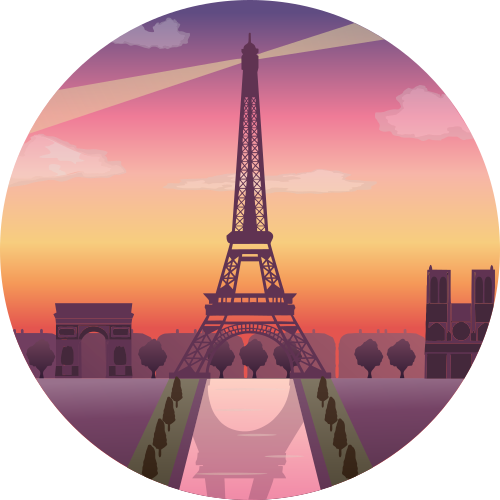

<h1 align="center">
Paris
</h1>

## Description

Inspired by elegant boulevards and Paris’s sunset glow, this theme trades bright champagne for dusty rose accents over calm plum-espresso tones. Soft dark editor backgrounds keep focus clear, while mauve surfaces and wine-tinted hovers add depth and balance, with a gentle blush accent guiding attention across the interface.

## Screenshots

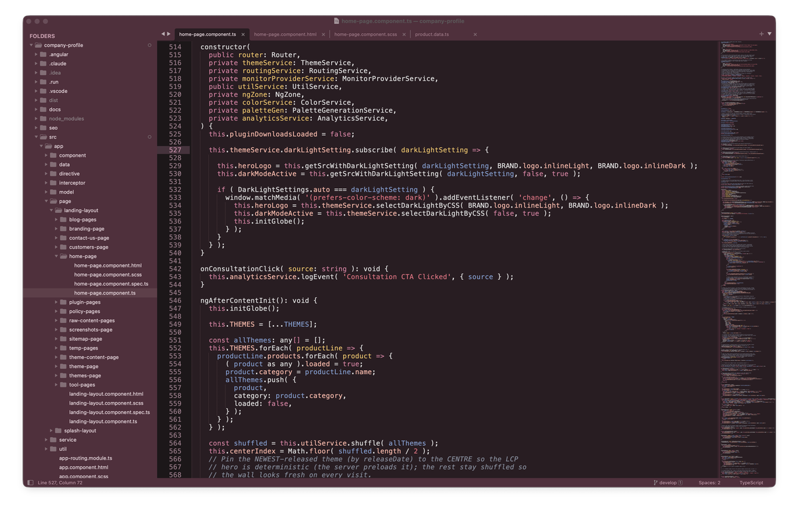

## Color Palette

<table>
   <tr>
      <td></td>
      <td>Background</td>
      <td>#281D22</td>
   </tr>
   <tr>
      <td></td>
      <td>Foreground</td>
      <td>#E0E0E0</td>
   </tr>
   <tr>
      <td></td>
      <td>Accent</td>
      <td>#D18FA8</td>
   </tr>
</table>

   

<h1 align="center">
Rio de Janeiro
</h1>

## Description

Inspired by Rio's lush hills, soft morning light, and ocean air, this theme blends airy minty backgrounds with confident rainforest greens and clean coastal blues. The editor stays bright and calm for long sessions, while crisp greens and balanced accents keep syntax readable and focused.

## Screenshots

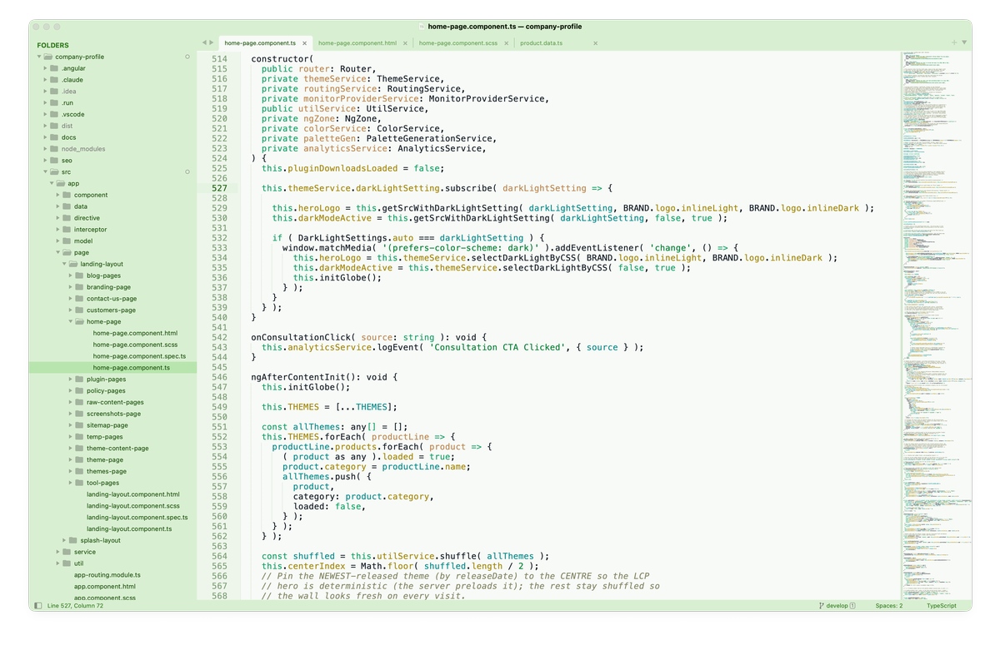

## Color Palette

<table>
   <tr>
      <td></td>
      <td>Background</td>
      <td>#F7FAF6</td>
   </tr>
   <tr>
      <td></td>
      <td>Foreground</td>
      <td>#131B25</td>
   </tr>
   <tr>
      <td></td>
      <td>Accent</td>
      <td>#375B2E</td>
   </tr>
</table>

   

<h1 align="center">
Tallinn
</h1>

## Description

Inspired by Tallinn's crisp light and Baltic calm, this theme pairs airy porcelain backgrounds with cool Nordic blues for a clean, focused coding experience. Soft, bright surfaces enhance readability, while deep ink accents and subtle lavender-rose highlights add clarity and warmth without losing the chill vibe.

## Screenshots

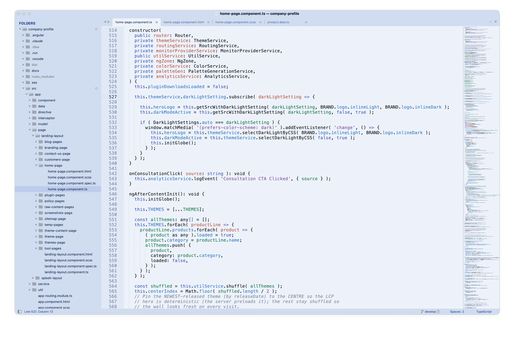

## Color Palette

<table>
   <tr>
      <td></td>
      <td>Background</td>
      <td>#EDF2FA</td>
   </tr>
   <tr>
      <td></td>
      <td>Foreground</td>
      <td>#131B25</td>
   </tr>
   <tr>
      <td></td>
      <td>Accent</td>
      <td>#3F4494</td>
   </tr>
</table>

   

<h1 align="center">
Tokyo
</h1>

## Description

Inspired by Tokyo's neon-lit side streets, midnight skylines, and the quiet glow of lantern-lined alleys, this theme blends deep indigo shadows with electric violet highlights to create a sleek, futuristic coding atmosphere. Moody blues keep the editor calm and focused, while luminous purples, soft lilacs, and crisp cyan accents add clarity and energy to key syntax elements.

## Screenshots

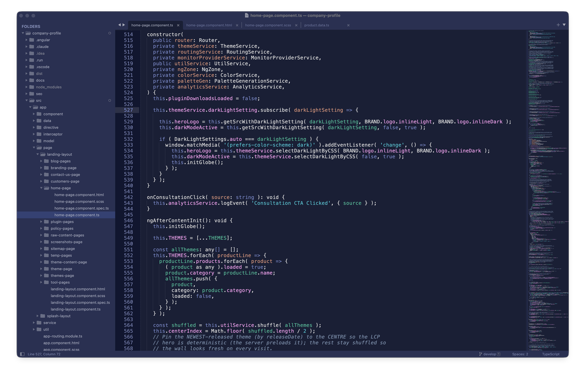

## Color Palette

<table>
   <tr>
      <td></td>
      <td>Background</td>
      <td>#1A1F35</td>
   </tr>
   <tr>
      <td></td>
      <td>Foreground</td>
      <td>#E0E0E0</td>
   </tr>
   <tr>
      <td></td>
      <td>Accent</td>
      <td>#7285DC</td>
   </tr>
</table>
